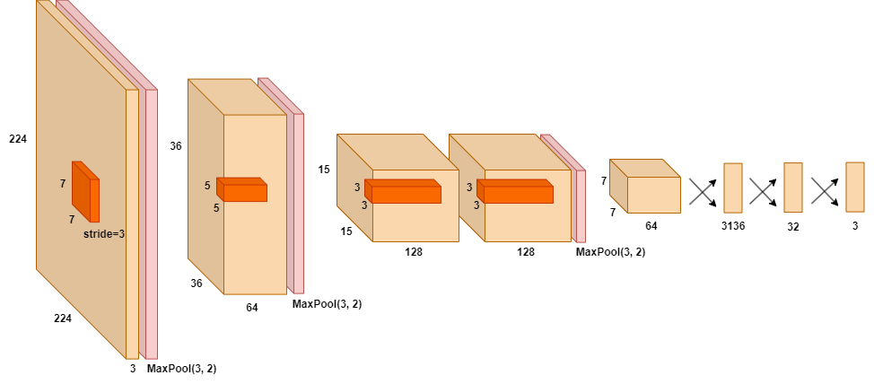

# Fruit Classifier

## Summary

The objective was to create a Convolutional Neural Network that is able to classify an image containing either a cherry, strawberry or tomato. The final model was trained on 2,892 images and a validation set of 600 images. The model was able to achieve an accuracy of 80.77% accuracy within an test set of 900 image.

## Prequisites

- Python
- PyTorch
- MatPlotLib

## Build Instructions

1. Unzip data.zip into home directory.
2. Create a 'models' folder for models to be stored into at each iteration.

To create a model, run `python train.py`

To test the model, run `python test.py`

## Content

- /report, contains Latex files used to write the report.
- data.zip, contains 4,392 images split into the training, testing and validation sets.
- model.pth, the trained model.
- net.py, the network used to create the final model.
- report.pdf, report describing the methodology, processes and discoveries.
- test.py, network testing script.
- train.py, network training script.

## Network Structure

